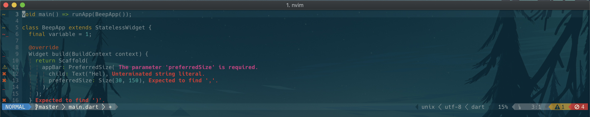

# lightline-languageclient
This plugin provides LanguageClient-neovim integration for the lightline plugin.



## Installation
Install using any plugin manager, for example shown here with vim-plug

```vim
call plug#begin()

" Plugin dependencies
Plug 'autozimu/LanguageClient-neovim', {
    \ 'branch': 'next',
    \ 'do': 'bash install.sh',
    \ }
Plug 'itchyny/lightline.vim'

Plug 'solderneer/lightline-languageclient'

call plug#end()
```

## Required configuration

1) Register the components

```vim
let g:lightline.component_expand = {
      \  'warning_count': 'lightline#languageclient#warnings',
      \  'error_count': 'lightline#languageclient#errors',
      \  'linter_ok': 'lightline#languageclient#ok',
      \ }
```

2) Color the components

```vim
let g:lightline.component_type = {
      \  'warning_count': 'warning',
      \  'error_count': 'error',
      \  'linter_ok': 'left',
      \ }
```

3) Add the components into your lightline config. May look different from mine :)

```vim
let g:lightline.active = {
      \ 'right': [
      \ [ 'error_count', 'warning_count', 'linter_ok' ],
      \ [ 'lineinfo' ],
      \ [ 'percent' ],
      \ [ 'fileformat', 'fileencoding', 'filetype' ]],
      \ 'left': [
      \ [ 'mode', 'paste' ],
      \ [ 'fugitive', 'readonly', 'filename', 'modified' ]] }
```

## Optional configuration

The text for the status can be replaced by overriding the following variables.

`g:lightline#languageclient#warnings` defines the warning text. Default is `W:`

`g:lightline#languageclient#errors` defines the error text. Default is `E:`

`g:lightline#languageclient#ok` defines the ok text. Default is `OK`

### Using icons as indicators

You can replace the text with icons, if you are using a patched font with FontAwesome or Powerline. A icon font can be specified using the unicode value, or by copying the literal from a website. For example, the config seen in the screenshot is shown below.

```vim
let g:lightline#languageclient#warnings = "\uf071 "
let g:lightline#languageclient#errors = "\uf05e "
let g:lightline#languageclient#ok = "\uf00c "
```

## License

Released under the MIT license.
